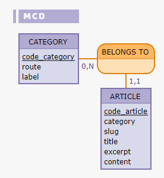
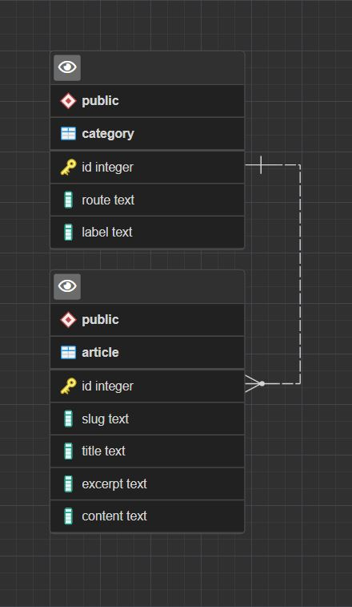
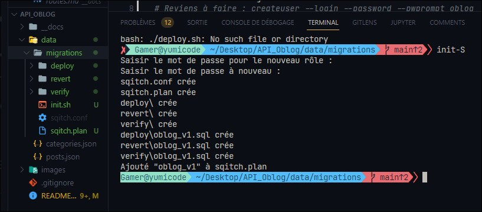
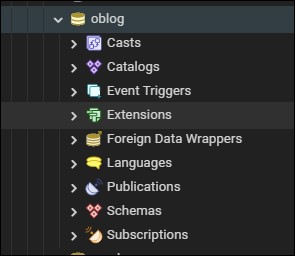

# TEAM MALABOU - API O'blog

@Fredo & @Helene

## Mise en place de l'API

<details>
<summary>Détails</summary>
<br>

### User stories

|        En tant que        |Je veux pouvoir |Dans le but de|
|----------------|-------------------------------|-----------------------------|
||--||--|
|Visiteur|   Accéder au site    |Visualiser le contenu du site            |
|Visiteur|   Accéder à un article    |Visualiser le contenu de l'article            |
||--||--|
|Utilisateur| Accéder à un article |Visualiser le contenu de l'article|
|Utilisateur|Créer un article | Rajouter un article à mon blog|
|Utilisateur|Modifier un article|Mettre à jour mon article|
|Utilisateur|Supprimer un article| detruire l'article|
||--||--|
|Utilisateur|Créer une catégorie | Rajouter une catégorie à mon blog|
|Utilisateur|Modifier une catégorie|Mettre à jour la catégorie|
|Utilisateur|Supprimer une catégorie| detruire la catégorie|

### MCD

Voici le *Modèle Conceptuel de Données*.

Structure des entités et associations faites avec [Mocodo](http://mocodo.wingi.net/)

```
BELONGS TO, 11 ARTICLE, 0N CATEGORY
CATEGORY: code_category, route, label

ARTICLE: code_article, category, slug, title, excerpt, content
:
```



Une catégorie peut contenir plusieurs articles mais un article ne possède qu'une catégorie.

### MLD

Ci-dessous le *Modèle Logique de Données*

```js
// Sous forme académique :
Category ( CodeCategory, Route, Label )
Article ( CodeArticle, Category, Slug, Title, Excerpt, Content, #CodeCategory )
BELONGS_TO ( CodeCategory, CodeArticle )
```

### MPD

Pour le *Modèle Physique de Données*, nous avons utilisé PgAdmin4 pour établir les liens entre nos tables.



</details>

### Mise en place de la base de données

<!-- <details>
<summary>Détails</summary>
<br> -->

### Migrations avec l'outil Sqitch

Documentation Sqitch [ici](https://sqitch.org/docs/manual/sqitch/)

    - Création d'un fichier init.sh
        - Configuration et création d'une BDD
        - Utilisation et démarrage de Sqitch 

#### 1. Fichier d'initialisation (init.sh)

```sh
#~ Création d'un script via les commandes POSTGRES
export PGUSER=postgres

createuser -l -P oblog
# Reviens à faire : createuser --login --password --pwprompt oblog
  
createdb -O oblog oblog
# Reviens à faire : createdb --owner=oblog oblog

#* Initialiser Sqitch avec le moteur postgres
sqitch init oblog --engine pg

#* Création d'une version 1 pour la BDD
sqitch add oblog_v1 -n "01 - Créations des tables article / category"
```

Le fichier permet de créer l'utilisateur avec un mot de passe associé ainsi que sa base de données.

L'initialisation nous permettra de gérer chaque version de la migration.

Dossier migrations :

- deploy
  - oblog_v1.sql
- revert
  - oblog_v1.sql
- verify
  - oblog_v1.sql

Après initialisation :



Et voici la base de données créée !



Le script d'initialisation est lancée seulement et seulement si [Postgres](https://www.postgresql.org/) est bien installé sur l'hôte.

Le script peut être lancé grâce à la commande suivante :

```sh
# Commande Windows
sh ./init.sh

# Commande Linux
chmod +x ./init.sh
./init.sh
```


#### 2. Déploiement de la base de données

```sh
#* Export variables d'environnements
export PGUSER=oblog
export PGPASSWORD=oblog

#* Deploy Global :
sqitch deploy -d oblog oblog_v1
# sqitch deploy -d oblog oblog_v2
```

Le script deploy.sh permet de générer nos tables dans la BDD.

Le script se lance de la même manière que l'init.sh :

```sh
# Commande Windows
sh ./deploy.sh

# Commande Linux
chmod +x ./deploy.sh
./deploy.sh
```

Et voici le visuel des tables et de leurs relations :


#### 3. Préparation d'un fichier import Ad Hoc

Importations ES6

```js
//~ IMPORTATION DOTENV
import 'dotenv/config';

//~ IMPORTATION DATA ---> utilisation de assert {type: "json"} (encore expérimental)
import articlesData from './posts.json' assert {type: "json"};
import categoriesData from './categories.json' assert {type: "json"};

//~ IMPORTATION DE PG CLIENT
import pg from 'pg';
const client = new pg.Client()
```
<!-- ^-- TODO exemple de boucle


<!-- </details> -->

### Mise en place du projet

<details>
<summary>Détails</summary>
<br>

</details>

- Initialisation du projet

- Mise en place des routes

- Gestion des erreurs

<!-- ^-- CREATE DOMAIN v_plate_fr AS TEXT
^-- CHECK(
^--    VALUE ~ '/^((?!WW|SS|[OUI])[A-Z]){2}-(\d{3})-((?!WW|SS|[OUI])[A-Z]){2}$/gm'
^-- );

^-Check VALUE
^NPM JOI
^Route path: /user/:userId(\d+) -->