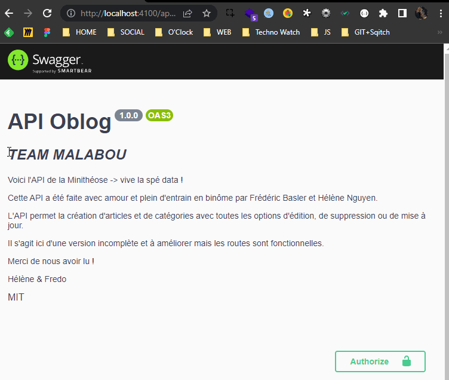

# TEAM MALABOU - API O'blog

@Fredo & @Helene

## Etude du projet

Tout le détail de notre initialisation de la gestion du projet se trouve [ici](./__docs__/01_Mise%20en%20place%20API)

## Mise en place de la base de données

Tout le détail de la mise en place de la base de données et de l'outil de versioning Sqitch c'est par [là](./__docs__/02_Base%20de%20donn%C3%A9es.md)

## Initialisation du projet

Toutes les étapes que nous avons effectué pour l'initialisation du projet sont [ici](./__docs__/03_Initialisation.md)

## Lancement du serveur

Le détail pour construire et lancer notre serveur se trouve [ici](./__docs__/04_Serveur.md)

## Mise en place des routes

Tout le détail de notre établissement des routes à partir des instructions suivantes

=> Routes nécessaire pour l'API O'blog

| route               |  GET  | POST  | PATCH | DELETE |
| ------------------- | :---: | :---: | :---: | :----: |
| /posts              |   ✅   |   ✅   |   ❌   |   ❌    |
| /posts/:id          |   ✅   |   ❌   |   ✅   |   ✅    |
| /posts/category/:id |   ✅   |   ❌   |   ❌   |   ❌    |
| /categories         |   ✅   |   ✅   |   ❌   |   ❌    |
| /categories/:id     |   ✅   |   ❌   |   ✅   |   ✅    |

C'est par [ici](./__docs__/05_Routes.md)

---

## Schéma pour la validation de notre body

Nous avons utilisé le module [Joi](https://joi.dev/api/?v=17.6.0) pour la validation des informations récupérées de notre body.

Tout le détail de notre démarche est [là](./__docs__/06_Schema.md)

## Mise en place du datamapper pour les requêtes

Pour les requêtes à la base de données, nous avons chois de passer par un datamapper.

Tout le détail est [ici](./__docs__/07_Datamapper.md)

## Mise en place des Models

Mise en place des class Article et Category dans l'optique de générer de nouvelles instances.

Tout le détail est [ici](./__docs__/08_Models.md)

## Mise en place des controllers

Tout le détail de notre gestion des controllers c'est par [là](./__docs__/09_Controllers.md)

---

## Mise en place de la documentation Swagger

Tout le détail de la création de notre swaggerDocs c'est par [là](./__docs__/10_swaggerDocs.md)

Et voilà un aperçu de notre documentation sur les routes

TADAAAAM

## Gestion des erreurs

Nous avons créé un fichier de logs en le laissant apparent pour afficher les tests que nous avons effectué.

Tous les résultats de nos tests c'est [là](./__docs__/11_ErrorHandling.md) !

## Petit mot d'adieux &#x1F618;

Cette API a été conçue avec passion et nous avons conscience qu'il y a encore des choses à améliorer, ce n'est qu'une mini-apothéose.
L'expérience fut riche et on remercie [O'Clock](https://oclock.io/) de nous avoir guidé jusque là !

Hélène & Fredo

