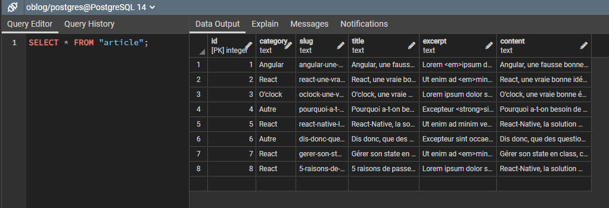
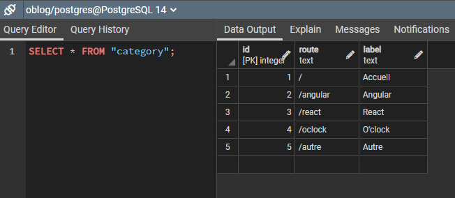
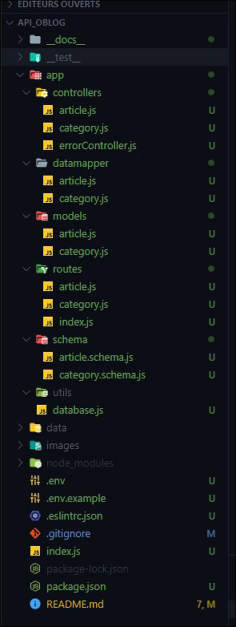

# TEAM MALABOU - API O'blog

@Fredo & @Helene

## Mise en place de l'API

<details>
    <summary>Détails</summary>
<br>

### User stories

|        En tant que        |Je veux pouvoir |Dans le but de|
|----------------|-------------------------------|-----------------------------|
||--||--|
|Visiteur|   Accéder au site    |Visualiser le contenu du site            |
|Visiteur|   Accéder à un article    |Visualiser le contenu de l'article            |
||--||--|
|Utilisateur| Accéder à un article |Visualiser le contenu de l'article|
|Utilisateur|Créer un article | Rajouter un article à mon blog|
|Utilisateur|Modifier un article|Mettre à jour mon article|
|Utilisateur|Supprimer un article| detruire l'article|
||--||--|
|Utilisateur|Créer une catégorie | Rajouter une catégorie à mon blog|
|Utilisateur|Modifier une catégorie|Mettre à jour la catégorie|
|Utilisateur|Supprimer une catégorie| detruire la catégorie|

### MCD

Voici le *Modèle Conceptuel de Données*.

Structure des entités et associations faites avec [Mocodo](http://mocodo.wingi.net/)

```
BELONGS TO, 11 ARTICLE, 0N CATEGORY
CATEGORY: code_category, route, label

ARTICLE: code_article, category, slug, title, excerpt, content
:
```


Une catégorie peut contenir plusieurs articles mais un article ne possède qu'une catégorie.

### MLD

Ci-dessous le *Modèle Logique de Données*

```js
// Sous forme académique :
Category ( CodeCategory, Route, Label )
Article ( CodeArticle, Category, Slug, Title, Excerpt, Content, #CodeCategory )
BELONGS_TO ( CodeCategory, CodeArticle )
```

### MPD

Pour le *Modèle Physique de Données*, nous avons utilisé PgAdmin4 pour établir les liens entre nos tables.


</details>

### Mise en place de la base de données

<details>
<summary>Détails</summary>
<br>

### Migrations avec l'outil Sqitch

Documentation Sqitch [ici](https://sqitch.org/docs/manual/sqitch/)

- Création d'un fichier init.sh
        - Configuration et création d'une BDD
        - Utilisation et démarrage de Sqitch

#### 1. Fichier d'initialisation (init.sh)

```sh
#~ Création d'un script via les commandes POSTGRES
export PGUSER=postgres

createuser -l -P oblog
# Reviens à faire : createuser --login --password --pwprompt oblog
  
createdb -O oblog oblog
# Reviens à faire : createdb --owner=oblog oblog

#* Initialiser Sqitch avec le moteur postgres
sqitch init oblog --engine pg

#* Création d'une version 1 pour la BDD
sqitch add oblog_v1 -n "01 - Créations des tables article / category"
```

Le fichier permet de créer l'utilisateur avec un mot de passe associé ainsi que sa base de données.

L'initialisation nous permettra de gérer chaque version de la migration.

Dossier migrations :

- deploy
  - oblog_v1.sql
- revert
  - oblog_v1.sql
- verify
  - oblog_v1.sql

Après initialisation :


Et voici la base de données créée !


Le script d'initialisation est lancée seulement et seulement si [Postgres](https://www.postgresql.org/) est bien installé sur l'hôte.

Le script peut être lancé grâce à la commande suivante :

```sh
# Commande Windows
sh ./init.sh

# Commande Linux
chmod +x ./init.sh
./init.sh
```

#### 2. Déploiement de la base de données

```sh
#* Export variables d'environnements
export PGUSER=oblog
export PGPASSWORD=oblog

#* Deploy Global :
sqitch deploy -d oblog oblog_v1
# sqitch deploy -d oblog oblog_v2
```

Le script deploy.sh permet de générer nos tables dans la BDD.

Le script se lance de la même manière que l'init.sh :

```sh
# Commande Windows
sh ./deploy.sh

# Commande Linux
chmod +x ./deploy.sh
./deploy.sh
```

Et voici le visuel des tables et de leurs relations :


#### 3. Préparation d'un fichier import Ad Hoc

Importations ES6

```js
//~ IMPORTATION DOTENV
import 'dotenv/config';

//~ IMPORTATION DATA ---> utilisation de assert {type: "json"} (encore expérimental)
import articlesData from './posts.json' assert {type: "json"};
import categoriesData from './categories.json' assert {type: "json"};

//~ IMPORTATION DE PG CLIENT
import pg from 'pg';
const client = new pg.Client()
```

*Important* On ouvre la connexion à la BDD

```js
await client.connect(); 
```

On génères des boucles qui permettent d'insérer les données dans la BDD
*INSERT INTO ARTICLE*

```js
    
    //* Boucle pour le fichier posts.json
    for (const article of articlesData) {
        // console.log(article)
        // article représente les colonnes de articlesData
        const query = {
            text: `
            INSERT INTO "article"("${Object.keys(article)[0]}", "${Object.keys(article)[1]}", "${Object.keys(article)[2]}", "${Object.keys(article)[3]}","${Object.keys(article)[4]}")
            VALUES ($1, $2, $3, $4, $5);`,
            values: [`${article.category}`, `${article.slug}`,`${article.title}`,`${article.excerpt}`,`${article.content}`]
        };
        await client.query(query);
    } 
    
```



```js

    //* Boucle pour le fichier categories.json
    for (let category of categoriesData) {
        // console.log(Object.keys(category)[1])
        // category représente les colonnes de categoriesData
            const query = {
                text: `
                INSERT INTO "category"("${Object.keys(category)[0]}", "${Object.keys(category)[1]}")
                VALUES ($1, $2);`,
                values: [`${category.route}`, `${category.label}`]
            };
            await client.query(query);
    }

```

*INSERT INTO CATEGORY*


*Important* On ferme la connexion à la BDD

```js
await client.end(); 
```

</details>

### Mise en place du projet

<details>
<summary>Détails</summary>
<br>

### 1. Initialisation du projet

On initialise le projet avec

```sh
npm init
```

Et on installe toutes les dépendances

```sh
npm i express dotenv pg helmet joi express-jsdoc-swagger
```

Ainsi que les dépendances dev

```sh
npm i eslint jest --save-dev
```

Vérification dans le package.json

```js
  "dependencies": {
    "dotenv": "^16.0.1",
    "express": "^4.18.1",
    "express-jsdoc-swagger": "^1.6.8",
    "helmet": "^5.1.0",
    "joi": "^17.6.0",
    "pg": "^8.7.3"
  },
  "devDependencies": {
    "eslint": "^8.17.0",
    "jest": "^28.1.1"
  }
```

### 2. Structure des fichiers

Nous sommes partis sur une architecture Model Controller avec un Datamapper pour récupérer nos données de la base de données



</details>

### 3. Mise en place du server

    - Création du point d'entrée index.js

Pour la création du serveur, on va importer dans notre fichier tous les modules nécessaires au fonctionnement du serveur.

Ci-dessous notre structure

```js
//~ENVIRONNEMENT
import 'dotenv/config';

//~IMPORT DES MODULES
import express from 'express';
const app = express();

import { router } from './app/routes/index.js';
import { _404 } from './app/controllers/errorController.js';

//~MISE EN PLACE DE SWAGGER POUR LA DOC
import expressJSDocSwagger from 'express-jsdoc-swagger';
import { options } from './app/utils/swaggerDocs.js';

expressJSDocSwagger(app)(options);

//~PROTECTION DE NOTRE API
import helmet from 'helmet';
app.use(helmet());

//~ENCODAGE
app.use(express.json());
app.use(express.urlencoded({ extended: true }));

//~AUTORISATION DES CORS
app.use((req, res, next) => {
  res.header('Access-Control-Allow-Origin', '*');
  res.setHeader('Access-Control-Allow-Headers', 'Content-Type');
  res.setHeader('Access-Control-Allow-Methods', 'GET,HEAD,OPTIONS,POST,PUT,PATCH,DELETE');
  next();
});

//~ROUTE
app.use(router);

//~ERROR
app.use(_404);

//~LANCEMENT DU SERVEUR
const PORT = process.env.PORT ?? 3000;

app.listen(PORT, () => {
   console.log(`\x1b[1;33m\u26a1Running server on : http://localhost:${PORT} \u26a1\x1b[0m`);
});
```

Les démarches importantes à effectuer sont :

- La configuration du fichier `.env` et l'importation de son module pour l'utilisation des variables d'environnement
- L'importation du module Express
- L'importation de notre router
- L'importation de notre fichier pour la gestion des erreurs à renvoyer
- La mise en place de Swagger pour la documentation de notre code
- La protection de notre API avec **Helmet**
- L'encodage pour la récupération des données du body
- La gestion des CORS pour les autorisations d'utilisation de notre API
- Le lancement de notre serveur

### 4. Mise en place des routes

- Création d'un point d'entrée index.js (router)

```js
//~ IMPORTATION ROUTER 
import { Router } from 'express';
const router = Router();

//~ IMPORTATION ARTICLE ROUTER
import { router as articleRouter } from './article.js';
router.use('/', articleRouter);

//~ IMPORTATION CATEGORY ROUTER
import { router as categoryRouter } from './category.js';
router.use('/', categoryRouter);

export { router };
```

- Création des routes pour article.js
  
```js
//TODO NE PAS OUBLIER DE RAJOUTER LES FONCTIONS
//~ IMPORTATIONS
import { Router } from 'express';
const router = Router();

//~ ROUTES ARTICLE
// GET /posts
router.get('/posts', );
// POST /posts
router.post('/posts', );

// GET /posts/[:id]
router.get('/posts/:id', );
// PATCH /posts/[:id]
router.patch('/posts/:id', );
// DELETE /posts/[:id]
router.delete('/posts/:id', );

export { router };
```

- Création des routes pour category.js

```js
//TODO NE PAS OUBLIER DE RAJOUTER LES FONCTIONS
//~ IMPORTATIONS
import { Router } from 'express';
const router = Router();

//~ ROUTES CATEGORY
// GET /posts/category/[:id]
router.get('/posts/category/:id', )

// GET /categories
router.get('/categories', )
// POST /categories
router.post('/categories', )

// GET /categories/[:id]
router.get('/categories/:id', )
// PATCH /categories/[:id]
router.patch('/categories/:id', )
// DELETE /categories/[:id]
router.delete('/categories/:id', )

export { router };
```

- Gestion des erreurs
  
Mise en place des erreurs 400 / 404 / 500

```js
//~ ERRORS CONTROLLERS

function _400(req, res) {
    res.status(400).json( 'Mauvaise requête' );
}

function _404(req, res) {
    res.status(404).json({ 'Error 404': 'Page Not Found' });
}

function _500(err, req, res) {
    res.status(500).json({ 'Error 500': err.message });
}

export { _400, _404, _500 };
```

---

---
//TODO FRAGMENTER LE README !
Todo :

- SwaggerDocs
- Controllers => toutes les méthodes
  - CRUD + join category
- Routes => functions
  - Requêtes paramétrées ( Route path: /user/:userId(\d+)  )
  - Utilisation de npm Joi (PATCH & POST)
- restClient => tests des routes
- DataMapper
  - CREATE DOMAIN ( CHECK )

```sql
CREATE DOMAIN v_plate_fr AS TEXT
CHECK(
     VALUE ~ '/^((?!WW|SS|[OUI])[A-Z]){2}-(\d{3})-((?!WW|SS|[OUI])[A-Z]){2}$/gm'
);
```

- Création des class MODELS (intermédiaire (avant le controller, après le dataMapper))
