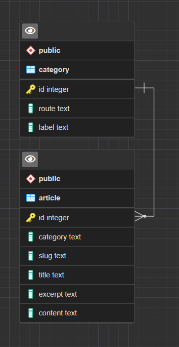

# TEAM MALABOU - API O'blog

@Fredo & @Helene
## Mise en place de l'API

<details>
<summary>Détails</summary>
<br>

### User stories


|        En tant que        |Je veux pouvoir |Dans le but de|
|----------------|-------------------------------|-----------------------------|
||--||--|
|Visiteur|   Accéder au site    |Visualiser le contenu du site            |
|Visiteur|   Accéder à un article    |Visualiser le contenu de l'article            |
||--||--|
|Utilisateur| Accéder à un article |Visualiser le contenu de l'article|
|Utilisateur|Créer un article | Rajouter un article à mon blog|
|Utilisateur|Modifier un article|Mettre à jour mon article|
|Utilisateur|Supprimer un article| detruire l'article|
||--||--|
|Utilisateur|Créer une catégorie | Rajouter une catégorie à mon blog|
|Utilisateur|Modifier une catégorie|Mettre à jour la catégorie|
|Utilisateur|Supprimer une catégorie| detruire la catégorie|


### MCD

Voici le *Modèle Conceptuel de Données*.

Structure des entités et associations faites avec [Mocodo](http://mocodo.wingi.net/)

```
BELONGS TO, 11 ARTICLE, 0N CATEGORY
CATEGORY: code_category, route, label

ARTICLE: code_article, slug, title, excerpt, content
:
```


Une catégorie peut contenir plusieurs articles mais un article ne possède qu'une catégorie.
### MLD

Ci-dessous le *Modèle Logique de Données*

```js
CATEGORY ( category_id, route, label )
ARTICLE ( article_id, slug, title, excerpt, content, #category_id )
```

### MPD

Pour le *Modèle Physique de Données*, nous avons utilisé PgAdmin4 pour établir les liens entre nos tables.



</details>


### Mise en place du projet

<details>
<summary>Détails</summary>
<br>


</details>

- Initialisation du projet

- Mise en place des routes

- Gestion des erreurs

