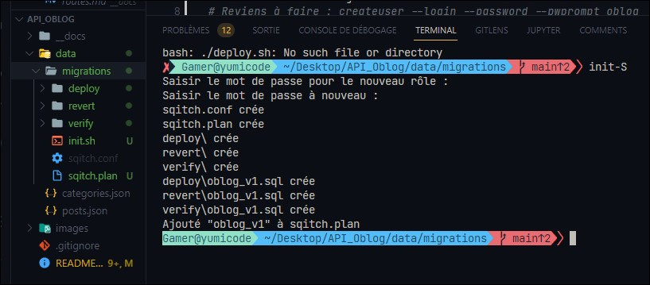
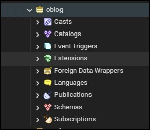
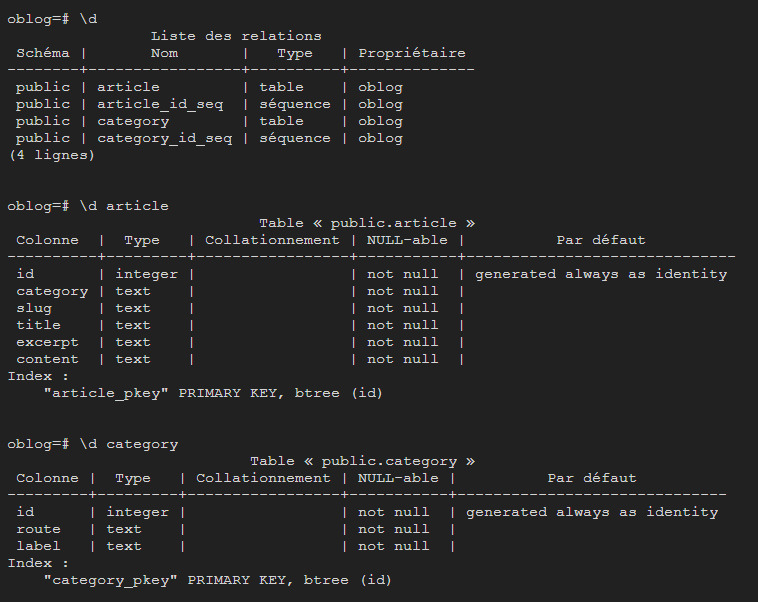
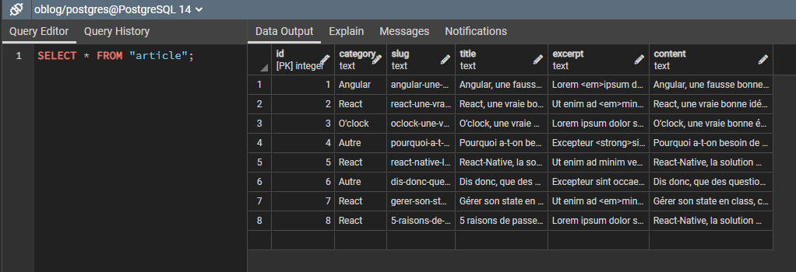
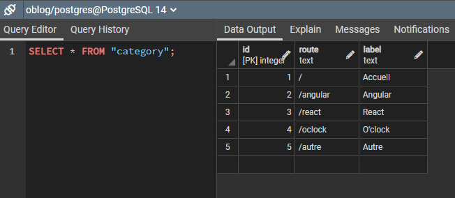

# Migrations avec l'outil Sqitch

Documentation Sqitch [ici](https://sqitch.org/docs/manual/sqitch/)

- Création d'un fichier init.sh
        - Configuration et création d'une BDD
        - Utilisation et démarrage de Sqitch

### 1. Fichier d'initialisation (init.sh)

```sh
#~ Création d'un script via les commandes POSTGRES
export PGUSER=postgres

createuser -l -P oblog
# Reviens à faire : createuser --login --password --pwprompt oblog
  
createdb -O oblog oblog
# Reviens à faire : createdb --owner=oblog oblog

#* Initialiser Sqitch avec le moteur postgres
sqitch init oblog --engine pg

#* Création d'une version 1 pour la BDD
sqitch add oblog_v1 -n "01 - Créations des tables article / category"
```

Le fichier permet de créer l'utilisateur avec un mot de passe associé ainsi que sa base de données.

L'initialisation nous permettra de gérer chaque version de la migration.

Dossier migrations :

- deploy
  - oblog_v1.sql
- revert
  - oblog_v1.sql
- verify
  - oblog_v1.sql

Après initialisation :



Et voici la base de données créée !



Le script d'initialisation est lancée seulement et seulement si [Postgres](https://www.postgresql.org/) est bien installé sur l'hôte.

Le script peut être lancé grâce à la commande suivante :

```sh
# Commande Windows
sh ./init.sh

# Commande Linux
chmod +x ./init.sh
./init.sh
```

### 2. Déploiement de la base de données

```sh
#* Export variables d'environnements
export PGUSER=oblog
export PGPASSWORD=oblog

#* Deploy Global :
sqitch deploy -d oblog oblog_v1
# sqitch deploy -d oblog oblog_v2
```

Le script deploy.sh permet de générer nos tables dans la BDD.

Le script se lance de la même manière que l'init.sh :

```sh
# Commande Windows
sh ./deploy.sh

# Commande Linux
chmod +x ./deploy.sh
./deploy.sh
```

Et voici le visuel des tables et de leurs relations :



### 3. Préparation d'un fichier import Ad Hoc

Importations ES6

Utilisation de cette méthode dans le cas où l'on cherche à lancer.
le fichier import_data.js directement depuis le dossier data

( Path Terminal : /API_Oblog/data )

En effet nous avons besoin du .env pour récupérer les variables d'environnements

```js
//! For ESMODULE, to get __dirname
//~ IMPORTATION PATH;
import path from 'path';
import {fileURLToPath} from 'url';

const __filename = fileURLToPath(import.meta.url);
const __dirname = path.dirname(__filename);
const dotenvPath = path.resolve(__dirname, "../.env");

//! Permet de fractionner notre dotenv en version ESMODULE
import dotenv from 'dotenv';
dotenv.config({ path: dotenvPath });
console.log(dotenv.config({ path: dotenvPath }))
```

Dans le cas où l'on lance notre fichier import_data.js directement depuis le root de notre API

( Path Terminal : /API_Oblog )

```js
//~ IMPORTATION DOTENV
import 'dotenv/config';

//~ IMPORTATION DATA ---> utilisation de assert {type: "json"} (encore expérimental)
import articlesData from './posts.json' assert {type: "json"};
import categoriesData from './categories.json' assert {type: "json"};

//~ IMPORTATION DE PG CLIENT
import pg from 'pg';
const client = new pg.Client()

//? Méthode manuelle pour configurer les variables d'environnements
// const client = new pg.Client({
    // user: 'oblog',
    // password: 'oblog',
    // database: 'oblog',
// });

// ou l'on peut aussi
import {client} from '../app/database.js';

```

*Important* On ouvre la connexion à la BDD

```js
await client.connect(); 
```

On génères des boucles qui permettent d'insérer les données dans la BDD
*INSERT INTO ARTICLE*

```js
    
    //* Boucle pour le fichier posts.json
    for (const article of articlesData) {
        // console.log(article)
        // article représente les colonnes de articlesData
        const query = {
            text: `
            INSERT INTO "article"("${Object.keys(article)[0]}", "${Object.keys(article)[1]}", "${Object.keys(article)[2]}", "${Object.keys(article)[3]}","${Object.keys(article)[4]}")
            VALUES ($1, $2, $3, $4, $5);`,
            values: [`${article.category}`, `${article.slug}`,`${article.title}`,`${article.excerpt}`,`${article.content}`]
        };
        await client.query(query);
    } 
    
```



```js

    //* Boucle pour le fichier categories.json
    for (let category of categoriesData) {
        // console.log(Object.keys(category)[1])
        // category représente les colonnes de categoriesData
            const query = {
                text: `
                INSERT INTO "category"("${Object.keys(category)[0]}", "${Object.keys(category)[1]}")
                VALUES ($1, $2);`,
                values: [`${category.route}`, `${category.label}`]
            };
            await client.query(query);
    }

```

*INSERT INTO CATEGORY*



*Important* On ferme la connexion à la BDD

```js
await client.end(); 
```

[Retour à la page d'accueil](../README.md)
