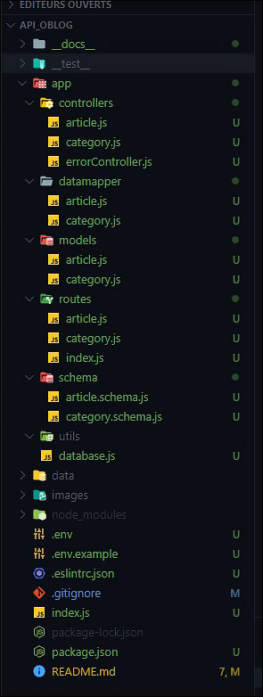

# Initialisation du projet

On initialise le projet avec

```sh
npm init
```

Et on installe toutes les dépendances

```sh
npm i express dotenv pg helmet joi express-jsdoc-swagger
```

Ainsi que les dépendances dev

```sh
npm i eslint jest --save-dev
```

Vérification dans le package.json

```js
  "dependencies": {
    "dotenv": "^16.0.1",
    "express": "^4.18.1",
    "express-jsdoc-swagger": "^1.6.8",
    "helmet": "^5.1.0",
    "joi": "^17.6.0",
    "pg": "^8.7.3"
  },
  "devDependencies": {
    "eslint": "^8.17.0",
    "jest": "^28.1.1"
  }
```

### Structure des fichiers

Nous sommes partis sur une architecture Model Controller avec un Datamapper pour récupérer nos données de la base de données



[Retour à la page d'accueil](../README.md)