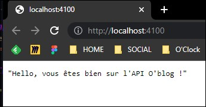

# Mise en place des routes

- Création d'un point d'entrée index.js (router)

```js
//~ IMPORTATION ROUTER 
import { Router } from 'express';
const router = Router();

//~ IMPORTATION ARTICLE ROUTER
import { router as articleRouter } from './article.js';
router.use('/', articleRouter);

//~ IMPORTATION CATEGORY ROUTER
import { router as categoryRouter } from './category.js';
router.use('/', categoryRouter);

export { router };
```

- Création des routes pour article.js
  
```js
//~ IMPORTATIONS
import { Router } from 'express';
const router = Router();

import { fetchAllArticles, createArticle, fetchOneArticle, updateArticle, deleteArticle } from '../controllers/article.js';

//~ ROUTES ARTICLE

// Identifie si c'est un nombre ou non 
// Et renvoie page 404 si ce n'est pas un nombre
//! link https://router.vuejs.org/guide/essentials/route-matching-syntax.html#custom-regex-in-params
//! ne pas oublier le deuxième '\'
// GET /posts/:id
router.get('/posts/:id(\\d+)', fetchOneArticle);
// POST /posts
router.post('/posts', createArticle);

// GET /posts/:id
router.get('/posts/:id(\\d+)', fetchOneArticle);
// PATCH /posts/:id
router.patch('/posts/:id(\\d+)', updateArticle);
// DELETE /posts/:id
router.delete('/posts/:id(\\d+)', deleteArticle);

export { router };

```

- Création des routes pour category.js

```js
//~ IMPORTATIONS
import { Router } from 'express';
const router = Router();

import {
  fetchArticlesByCategoryId,
  fetchAllCategories,
  createCategory,
  fetchOneCategory,
  updateCategory,
  deleteCategory
} from '../controllers/category.js';

//~ ROUTES CATEGORY
// GET /posts/category/[:id]
router.get('/posts/category/:id(\\d+)', fetchArticlesByCategoryId);

// GET /categories
router.get('/categories', fetchAllCategories);
// POST /categories
router.post('/categories', createCategory);

// GET /categories/[:id]
router.get('/categories/:id(\\d+)', fetchOneCategory);
// PATCH /categories/[:id]
router.patch('/categories/:id(\\d+)', updateCategory);
// DELETE /categories/[:id]
router.delete('/categories/:id(\\d+)', deleteCategory);

export { router };

```

Pour le test de nos routes, nous avons indiqué un message test sur le point d'entrée de nos routes.

Et voilà l'affichage !



- Gestion des erreurs
  
Mise en place des erreurs 400 / 404 / 500

```js
//~ ERRORS CONTROLLERS

function _400(req, res) {
    res.status(400).json( 'Mauvaise requête' );
}

function _404(req, res) {
    res.status(404).json({ 'Error 404': 'Page Not Found' });
}

function _500(err, req, res) {
    res.status(500).json({ 'Error 500': err.message });
}

export { _400, _404, _500 };
```

[Retour à la page d'accueil](../README.md)