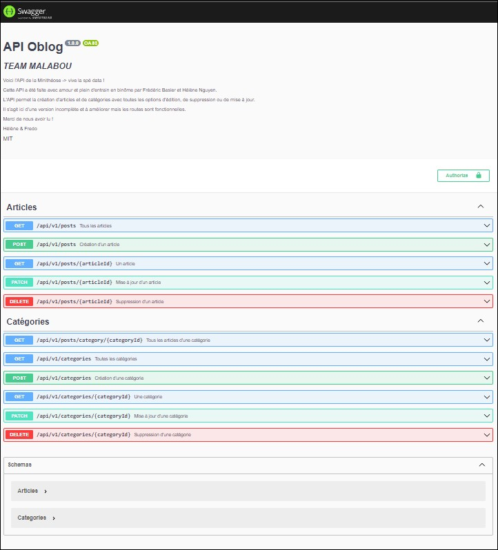

# Mise en place de la documentation Swagger

Pour la documentation en JSdocs, nous avons choisi d'utiliser le module `express-jsdoc-swagger` qui permet de générer de la documentation à partir de nos commentaires écrits selon une convention que l'on peut retrouver [ici](https://jsdoc.app/)

Pour la documentation du module, nous nous sommes appuyés sur le site des créateurs [là](https://brikev.github.io/express-jsdoc-swagger-docs/#/)

## Choix des options

Ici nous retrouvons les options choisis pour notre documentation.

```js

//! Pour les modules ES6, récupérer le __dirname
//source : https://bobbyhadz.com/blog/javascript-dirname-is-not-defined-in-es-module-scope#:~:text=The%20__dirname%20or%20__,directory%20name%20of%20the%20path.
import path from 'path';
import {fileURLToPath} from 'url';

const __filename = fileURLToPath(import.meta.url);
const __dirname = path.dirname(__filename);


const options = {
    info: {
        version: "1.0.0",
        title: "API Oblog",
        // description: `*TEAM MALABOU* Voici l'API de la Minithéose (PS: vive la spé data !)`,
        description: `ICI LA DESCRIPTION`,
        license: {
            name: "MIT",
        },
    },
    paths:{
        
    },
    security: {
        BasicAuth: {
            type: "http",
            scheme: "basic",
        },
    },
    swaggerUIPath: "/api-docs" ,
    baseDir: __dirname,
    filesPattern: "../**/*.js",
};
  
export { options };
```

Ces options sont importés dans notre point d'entrée principal `index.js`

```js
// //~MISE EN PLACE DE SWAGGER POUR LA DOC
import expressJSDocSwagger from 'express-jsdoc-swagger';
import { options } from './app/utils/swaggerDocs.js';

expressJSDocSwagger(app)(options);
```
Cela nous permet de récupérer toute la documentation de notre code et de le répertorier.

## Exemple de documentation des routes

```js
/**
 * GET /api/v1/posts
 * @summary Tous les articles
 * @description Récupère tous les articles
 * @tags Articles
 * @return {string} 200 - success response - application/json
 * @example response - 200 - success response - application/json
 * {
  "id": 1,
  "category": "Angular",
  "slug": "angular-une-fausse-bonne-idee",
  "title": "Angular, une fausse bonne idée ?",
  "excerpt": "Lorem <em>ipsum dolor</em> sit amet, consectetur adipisicing elit, sed do eiusmod tempor incididunt ut labore et dolo",
  "content": "Angular, une fausse bonne idée ? Lorem ipsum dolor sit amet, consectetur adipisicing elit, sed do eiusmod tempor incidi",
  "category_id": 2
}
 * @return {string} 500 - error response 
 * @example response - 500 - error response
 * {
 *   "Error 500": "message"
 * }
 */
router.get('/api/v1/posts', fetchAllArticles);
```
Et voilà le résultat 



Tout est bien répertorié avec les exemples de réponses qu'on peut avoir !

[Retour à la page d'accueil](../README.md)